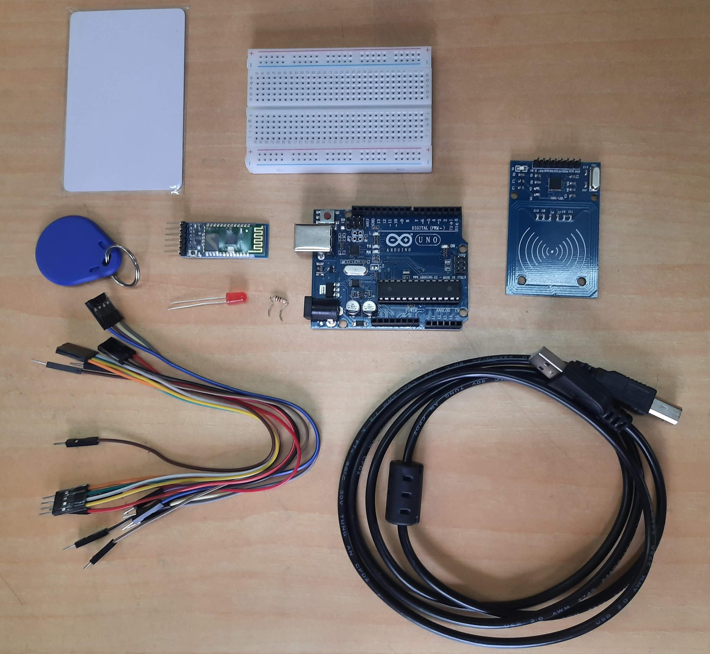
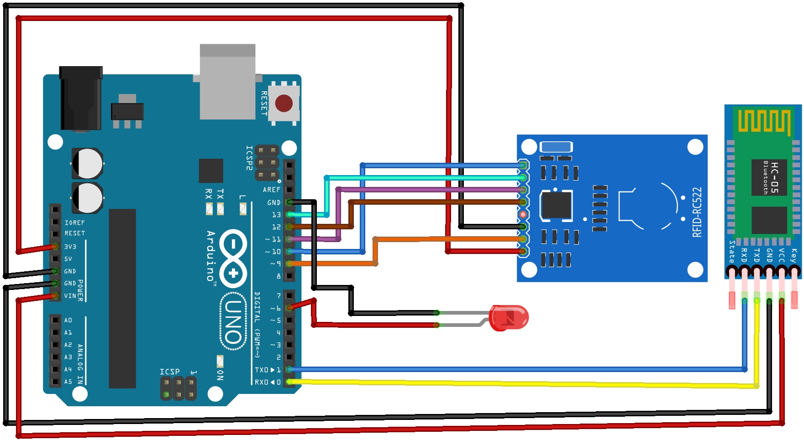

# Arduino RFID Attendance System with Android App

This project is an RFID-based attendance system that uses an Arduino Uno microcontroller, an RFID reader module (MFRC522), a Bluetooth module (HC-05), and an Android app. The system allows users to scan their RFID cards to mark their attendance. The Android app can be used to view the attendance data or export it as a CSV file.

## Components:
- Arduino UNO
- HC-05 Bluetooth Module 
- MFRC522 RFID Module
- Jumper Wires
- Breadboard 
- LED
- 1K Resistor
- RFID Tags or Cards

## Connections:

## Andriod App CodeBlock:

